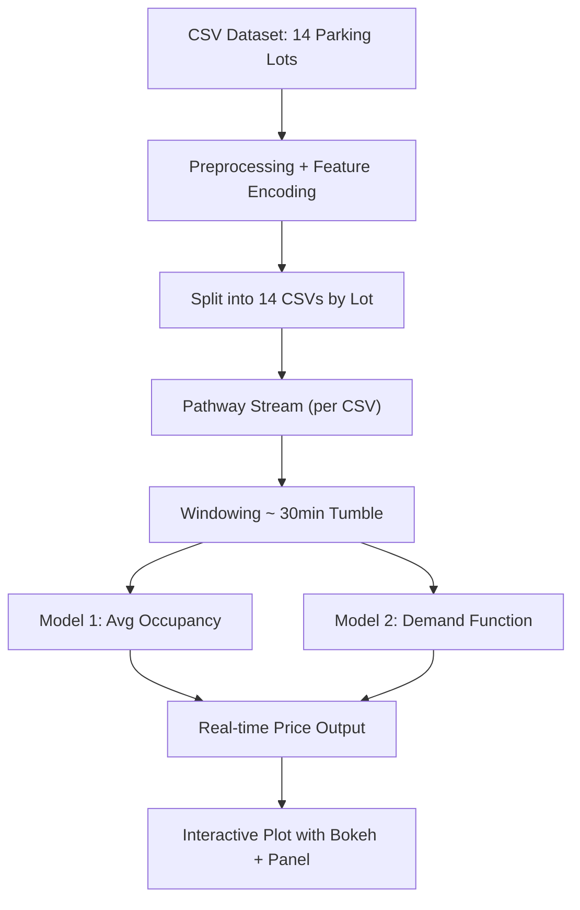

# Dynamic Pricing for Urban Parking Lots

A real-time pricing engine that has two models. One linear and kind of simplistic and another one that adjusts parking prices dynamically based on occupancy, queue length, traffic conditions, vehicle type, and special events. Implemented as part of Summer Analytics 2025 using **Pathway** for real-time data streaming and **Bokeh/Panel** for visualization.

---

## Project Overview

Urban parking suffers from two extremes: overcrowding at popular spots and underutilization elsewhere. Static pricing fails to adapt to varying demand patterns.

**This project simulates dynamic pricing across 14 parking lots in real time**, using data-driven decision-making. Key features:

* Real-time simulation using Pathway
* Dynamic pricing based on usage patterns
* Two pricing models implemented:

  * **Model 1:** Baseline linear pricing using average occupancy
  * **Model 2:** Demand-based pricing using multiple features
* Live, interactive visualizations using Panel and Bokeh

---

## Tech Stack

| Category         | Tools/Tech                     |
| ---------------- | ------------------------------ |
| Real-time engine | [Pathway](https://pathway.com) |
| Visualization    | Bokeh, Panel                   |
| Data Handling    | Pandas, CSV                    |
| Language         | Python 3.11 (Google Colab)     |

---

## Architecture Diagram



---

## Architecture & Workflow Details

### 1. **Data Source**

* Raw CSV includes 14 lots with timestamps, occupancy, queue, traffic, vehicle types.
* Categorical features like vehicle type and traffic level are numerically encoded but based on their further purpose in model 2 based on weightage of each parameter in the pricing formula.

### 2. **Why Split the Dataset?**

Handling all 14 lots in one stream with proper key-based filtering inside Pathway became computationally inconsistent and made debugging harder. To ensure that each lot was independently and fairly streamed, we:

* Sorted data by `SystemCodeNumber`
* Exported one CSV per lot
* Streamed each lot’s data using `pw.demo.replay_csv`

This simplification:

* Reduced stream lag
* Made visualization easier per lot
* Ensured pricing updates were accurate and clean

### 3. **Streaming with Pathway**

Each CSV is streamed into Pathway with a simulated delay to mimic real-time flow. Using tumbling windows (`datetime.timedelta(minutes=30)`), we computed rolling stats like average occupancy.

### 4. **Model 1: Baseline Linear**

```python
price = 10 + 5 * (avg_occupancy / capacity)
```

* Smooth pricing
* Intuitive and explainable
* Price fluctuates from \$10 to \$15

### 5. **Model 2: Demand Function**

```python
demand = 1.2*(occ_avg / cap) + 0.05*queue_len + 0.2*traffic + 0.8*special_day + 0.2*vehicle_type
price = 10 + 5*(demand)
```

* More features
* Uses normalized queue length, traffic, vehicle type
* Coefficients tuned for business sense (e.g. traffic reduces demand)
* Pricing stays bounded

### 6. **Visualization with Bokeh + Panel**

* Each lot visualized separately
* Real-time line charts for price across time

---

## How to Run

1. Clone this repo
2. Open `Manas_Patel_SA'25_Project.ipynb` in Google Colab
3. Upload any one `parking_stream_<lotname>.csv`
4. Run all cells sequentially
5. At the end, call `pw.run()`
6. Observe dynamic pricing plot

---

## Results

* **Model 1**: Easy to interpret, smooth pricing updates
* **Model 2**: More responsive, accounts for external demand factors
* Real-time pricing graph helps justify changes

---

## Completed Requirements

* [x] Baseline + Advanced Pricing Models
* [x] Pathway-based Real-Time Streaming
* [x] Pricing logic as function of features
* [x] Real-Time Visualization
* [x] Clipped and smooth price outputs
* [x] Intuitive business-aligned logic

---

## Acknowledgments

* Pathway Team
* Analytics Club @ IIT Guwahati
* Summer Analytics 2025 Organizers
